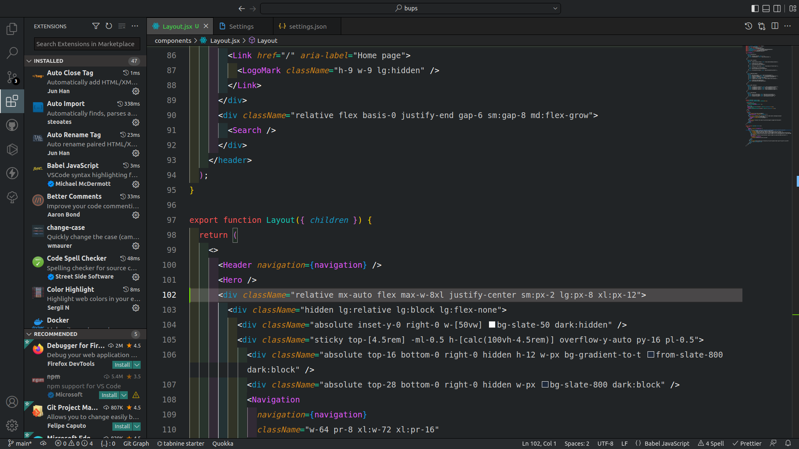

# kayhan-color-theme for VS Code.

## Install

1. Go to [VS Marketplace](https://marketplace.visualstudio.com/items?itemName=KazimKayhan.kayhan-color-theme).
2. Click on the "Install" button.
3. Then from your settings activate the theme.

## Override this theme

To override this (or any other) theme in your personal config file, please follow the guide in the [color theme](https://code.visualstudio.com/api/extension-guides/color-theme) documentation. This is handy for small tweaks to the theme without having to fork and maintain your own theme.

## Contribute

1. Clone and open this [repo](https://github.com/kazim-kayhan/kayhan-color-theme) in VS Code
2. Run `yarn` or npm to install the dependencies.
3. Press `F5` to open a new window with your extension loaded
4. Open `Code > Preferences > Color Theme` [`⌘k ⌘t`] and pick the "kayhan-color-theme" theme.
5. Make changes to the [`/themes/kayhan-color-theme.json`](https://github.com/kazim-kayhan/kayhan-color-theme/blob/main/themes/kayhan-color-theme.json) file. That's it!
6. To test it locally and see how your design looks, run the file via Run menu it will be open it in a new window.
7. Once you're happy, commit your changes and open a PR.

## Publish (internal)

> Note: Publishing a new version of this theme is only meant for maintainer.